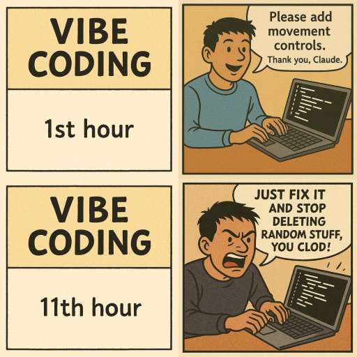

# ИИ помощники

ИИ помощники — это программное приложение, которое использует искусственный интеллект для понимания естественного языка и выполнения задач для пользователей.  

<table>
  <thead>
    <tr>
      <th>Name</th>
      <th>iOS</th>
      <th>Android</th>
      <th>Комментарий</th>
    </tr>
  </thead>
  <tbody>
    <tr>
      <td><a href="https://chatgpt.com/">ChatGPT (OpenAI)</a></td>
      <td><a href="https://apps.apple.com/us/app/chatgpt/id6448311069">Yes</a></td>
      <td><a href="https://play.google.com/store/apps/details?id=com.openai.chatgpt">Yes</a></td>
      <td>Самый универсальный</td>
    </tr>
    <tr>
      <td><a href="https://www.perplexity.ai/">Perplexity</a></td>
      <td><a href="https://apps.apple.com/us/app/perplexity-ask-anything/id1668000334">Yes</a></td>
      <td><a href="https://play.google.com/store/apps/details?id=ai.perplexity.ask">Yes</a></td>
      <td></td>
    </tr>
    <tr>
      <td><a href="https://www.deepseek.com/">DeepSeek</a></td>
      <td><a href="https://apps.apple.com/us/app/deepseek-ai-assistant/id6737597349">Yes</a></td>
      <td><a href="https://play.google.com/store/apps/details?id=com.deepseek.ai">Yes</a></td>
      <td></td>
    </tr>
    <tr>
      <td><a href="https://qwen.ai/">Qwen AI (Alibaba)</a></td>
      <td><a href="https://apps.apple.com/app/id6743778442">Yes</a></td>
      <td><a href="https://play.google.com/store/apps/details?id=ai.qwenlm.chat.android&pli=1">Yes</a></td>
      <td></td>
    </tr>
    <tr>
      <td><a href="https://claude.ai/">Claude (Anthropic)</a></td>
      <td><a href="https://apps.apple.com/us/app/claude-by-anthropic/id6473753684">Yes</a></td>
      <td><a href="https://play.google.com/store/apps/details?id=ai.claude.app">Yes</a></td>
      <td></td>
    </tr>
    <tr>
      <td><a href="https://codeassist.google">Gemini Code Assist</a></td>
      <td>No</td>
      <td>No</td>
      <td></td>
    </tr>
    <tr>
      <td><a href="https://github.com/features/copilot">GitHub Copilot (Free)</a></td>
      <td><a href="https://apps.apple.com/us/app/github/id1477376905">Via GitHub Mobile</a></td>
      <td><a href="https://play.google.com/store/apps/details?id=com.github.android">Via GitHub Mobile</a></td>
      <td></td>
    </tr>
    <tr>
      <td><a href="https://copilot.microsoft.com/">Microsoft Copilot</a></td>
      <td><a href="https://apps.apple.com/us/app/microsoft-copilot/id6472538445">Yes</a></td>
      <td><a href="https://play.google.com/store/apps/details?id=com.microsoft.copilot">Yes</a></td>
      <td></td>
    </tr>
    <tr>
      <td><a href="https://grok.com/">Grok (xAI)</a></td>
      <td><a href="https://apps.apple.com/us/app/grok/id6670324846">Yes</a></td>
      <td><a href="https://play.google.com/store/apps/details?id=ai.x.grok">Yes</a></td>
      <td></td>
    </tr>
    <tr>
      <td><a href="https://windsurf.com/">Windsurf</a></td>
      <td>No</td>
      <td>No</td>
      <td>Не доступен в Казахстане</td>
    </tr>
    <tr>
      <td><a href="https://www.continue.dev/">Continue.dev</a></td>
      <td>No</td>
      <td>No</td>
      <td>Плагин для IDE</td>
    </tr>
    <tr>
      <td><a href="https://cursor.com/">Cursor</a></td>
      <td>No</td>
      <td>No</td>
      <td>Редактор кода</td>
    </tr>
    <tr>
      <td><a href="https://aws.amazon.com/ru/q/developer/">Amazon Q Developer</a></td>
      <td>No</td>
      <td>No</td>
      <td></td>
    </tr>
    <tr>
      <td><a href="https://www.qodo.ai/">Qodo</a></td>
      <td>No</td>
      <td>No</td>
      <td></td>
    </tr>
    <tr>
      <td><a href="https://www.nomic.ai/gpt4all">GPT4All</a></td>
      <td>No</td>
      <td>No</td>
      <td>Для работы оффлайн</td>
    </tr>
    <tr>
      <td><a href="https://www.tabbyml.com/">Tabby</a></td>
      <td>No</td>
      <td>No</td>
      <td></td>
    </tr>
    <tr>
      <td><a href="https://www.codegpt.co/">Code GPT</a></td>
      <td>No</td>
      <td>No</td>
      <td>Плагин для IDE</td>
    </tr>
    <tr>
      <td><a href="https://rugpt.io/">ruGPT</a></td>
      <td>No</td>
      <td>No</td>
      <td>Требует регистрации. Платное.</td>
    </tr>
    <tr>
      <td><a href="https://higgsfield.ai/chat">higgesfield</a></td>
      <td>No</td>
      <td>No</td>
      <td>Требует регистрации. Бесплатная генерация картинок.</td>
    </tr>
  </tbody>
</table>