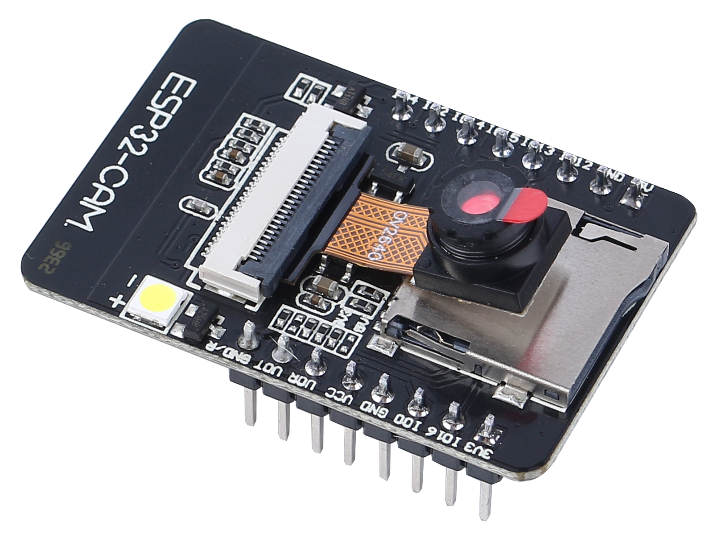
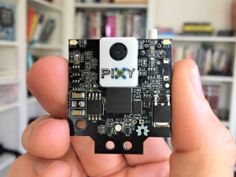
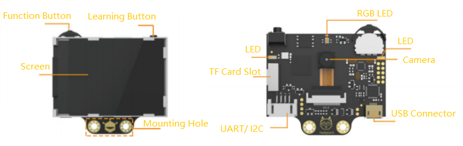
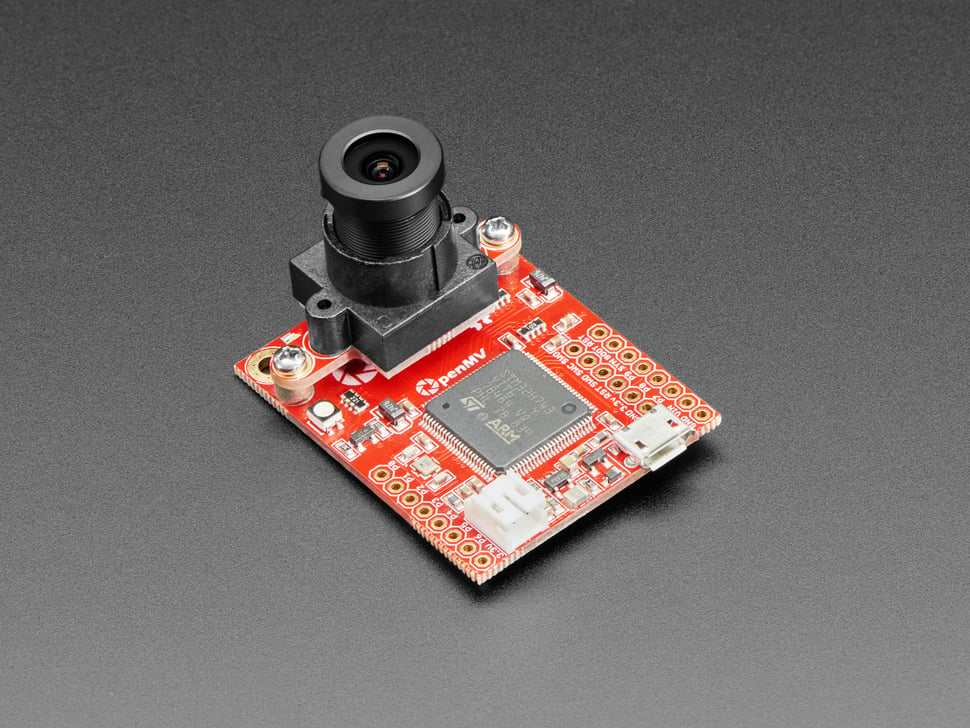
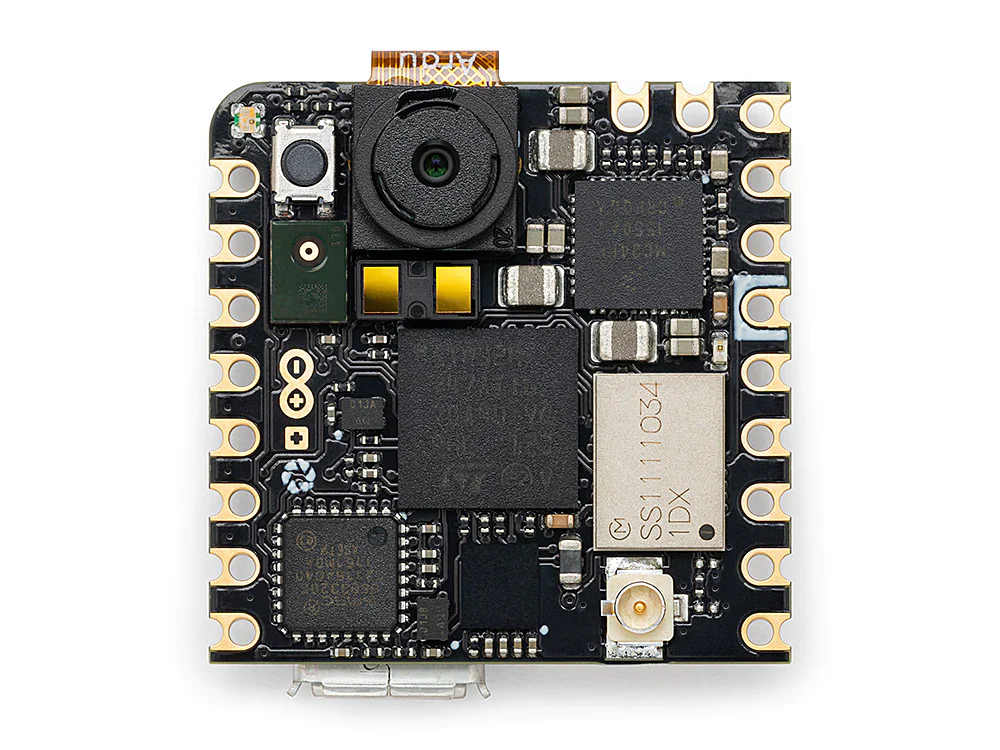
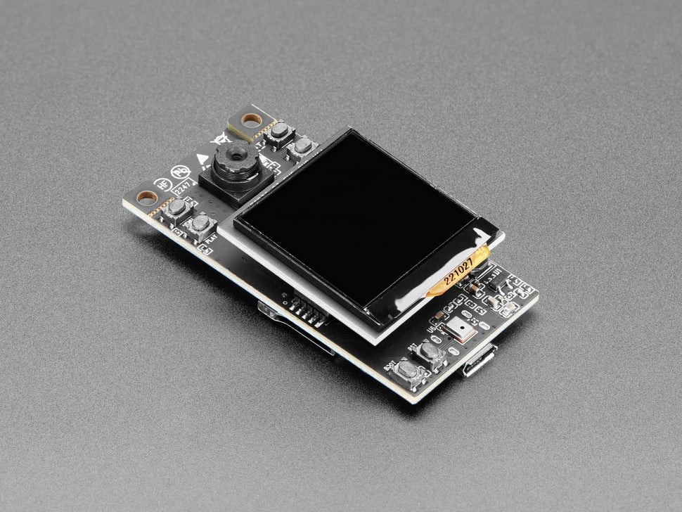

# ИИ‑камеры для роботов и хобби‑проектиков

В последние годы появилось множество недорогих камерных модулей с поддержкой нейронных сетей и компьютерного зрения.Такие **ИИ‑камеры** позволяют реализовать функции распознавания лиц, отслеживания объектов, классификации изображений и даже простейшего анализа сцен без полноценного компьютера.Ниже приведено краткое описание нескольких популярных моделей.

## ESP32‑CAM

  

* **Описание.** ESP32‑CAM— недорогой модуль на базе микроконтроллера ESP32 с камерой OV2640.Модуль не имеет USB‑разъёма, зато оборудован слотом microSD и может работать как автономная Wi‑Fi‑камера.Устройство имеет небольшой размер, поддерживает 802.11b/g/n, встроенный 520КБ SRAM, 4МБ внешней PSRAM и может выполнять базовые алгоритмы компьютерного зрения, например обнаружение лица.
* **Особенности.** Модуль поддерживает интерфейсы UART, SPI, I²C, PWM и ADC.Он может передавать изображения по Wi‑Fi, хранить их наmicroSD‑карте, поддерживает режимы сна и обновление прошивки по OTA.
* **Официальная страница.** Производитель AI‑Thinker публикует описание модуля на сайте (например на **ai-thinker.com**).Также характеристики доступны на странице RandomNerdTutorials.
* **Туториал.** Подробное руководство по организации веб‑стриминга и распознаванию лиц в среде ArduinoIDE есть на сайте [RandomNerdTutorials](https://randomnerdtutorials.com/esp32-cam-video-streaming-face-recognition-arduino-ide/).

## Pixy(Pixy2)

  

* **Описание.** Pixy (CMUcam5)— камера с аппаратным распознаванием цвета и отслеживанием объектов.Версия **Pixy2** стала быстрее и компактнее: она умеет обнаруживать линии и перекрёстки для роботов‑линейщиков, обеспечивая частоту 60к/с, и снабжена встроенным источником света.Камера обучается «видеть» объекты по цвету, а затем передаёт информацию на контроллер.
* **Особенности.** Pixy2 хранит библиотеки для Arduino, LEGOMindstormsEV3 и RaspberryPi; поддерживает интерфейсы SPI, I²C, UART и USB; может работать с различными контроллерами и конфигурируется через программу PixyMon наWindows/Mac/Linux.
* **Официальная страница.** Документация и исходники размещены на [сайте Pixycam](https://docs.pixycam.com/wiki/doku.php?id=wiki:v2:overview).
* **Туториал.** Быстрый старт описан в [Quick‑StartGuide forPixy2](https://docs.pixycam.com/wiki/doku.php?id=wiki:v2:pixy_regular_quick_start): установка PixyMon, обучение объекта и подключение к Arduino или RaspberryPi.

## HuskyLens

  

* **Описание.** HuskyLens от компании DFRobot— камера с процессором KendryteK210 и 2‑дюймовым IPS‑экраном.Она имеет семь встроенных алгоритмов (распознавание лиц, отслеживание и распознавание объектов, линия‑фолловинг, распознавание цвета, чтение тегов и классификация объектов).Камера учится объектам нажатием кнопки, а затем может передавать данные по UART или I²C в Arduino или micro:bit.
* **Особенности.** Устройство оснащено 2‑мегапиксельным сенсором OV2640/GC0328, 8МБ памяти PSRAM/Flash, дисплеем 320×240px и кнопками «Функция» и «Обучение» для переключения режимов и обучения.Питание 3,3–5В, интерфейсы UART/I²C, обновление прошивки через USB.
* **Официальная страница.** Подробное описание и документация доступны в викиDFRobot: [HuskyLens V1.0 SKUSEN0305/SEN0336](https://wiki.dfrobot.com/HUSKYLENS_V1.0_SKU_SEN0305_SEN0336).
* **Туториал.** Для работы с контроллерамиREV используется руководство «HuskyLens Intro for FIRST TechChallenge»— оно показывает подключение по I²C и примеры использования в роботе.

## OpenMVCam

  

* **Описание.** **OpenMV Cam**— маленькая микроконтроллерная камера для простых задач компьютерного зрения.Разработчики называют проект «Arduino для машинного зрения»: камера запускает скрипты на MicroPython и способна выполнять простые операции распознавания объектов и цветов.
* **Особенности.** В версии **OpenMVRT1062** используются процессор ARMCortex‑M7 600МГц, сенсор OV5640 (5МП), 32МБ SDRAM, 1МБ SRAM и 16МБ Flash; есть слот microSD (25МБ/с), Wi‑Fi802.11a/b/g/n, Bluetooth5.1, Ethernet 10/100Мбит/с и акселерометр.Камеры OpenMV программируются через IDE под Windows/Mac/Linux.
* **Официальная страница.** Основная информация публикуется на сайте [openmv.io](https://openmv.io) и в документации MicroPython.
* **Туториал.** Подробный курс «OpenMVCam Tutorial» доступен в документации MicroPython— раздел «Overview» объясняет цели проекта и показывает, как настроить MicroPython и IDE.  Для более мощной версии RT1062 имеется руководство на сайте EdgeImpulse, где описаны настройка IDE, загрузка модели и измерение энергопотребления.

## ArduinoNiclaVision

  

* **Описание.** NiclaVision— компактная плата от Arduino с двухмегапиксельной камерой GC2145, двумя ядрами STM32H747AII6 (Cortex‑M7до480МГц и Cortex‑M4до240МГц) и интегрированными датчиками: микрофон, датчик расстояния, 6‑осевой IMU.Благодаря Wi‑Fi и BluetoothLE плата подходит для задачи отслеживания объектов, предиктивного обслуживания и отправки данных в облако.
* **Особенности.** Устройство поддерживает MicroPython, снабжено слотом microSD, может питаться от аккумулятора, содержит различные периферийные порты и программируется как через ArduinoIDE, так и через OpenMVIDE.
* **Официальная страница.** Подробные характеристики представлены в [документации Arduino](https://docs.arduino.cc/hardware/nicla-vision/).
* **Туториал.** Руководство «GettingStarted withNiclaVision» (docs.arduino.cc/tutorials/nicla‑vision/getting‑started) показывает настройку OpenMVIDE, создание простого скрипта на MicroPython и подключение платы к ArduinoIDE (доступно на сайте Arduino).

## ESP32‑S3‑EYE

  

* **Описание.** ESP32‑S3‑EYE— маленькая AI‑плата от Espressif, основанная на SoC ESP32‑S3 и фреймворке ESP‑WHO.Она оснащена 2‑мегапиксельной камерой, LCD‑дисплеем и микрофоном.Модуль имеет 8МБ OctalPSRAM и 8МБ флеш‑памяти; поддерживает передачу изображений по Wi‑Fi и отладку через Micro‑USB.
* **Особенности.** Разработанная для задач компьютерного зрения и аудиоанализа, плата поставляется с демо‑примерами распознавания лиц и других объектов.
* **Официальная страница.** Описание платы и спецификации опубликованы на сайте Espressif: [ESP32‑S3‑EYE Overview](https://www.espressif.com/en/products/devkits/esp32-s3-eye/overview).
* **Туториал.** Пример разработки и настроек камеры для распознавания лиц входит в репозиторий ESP‑WHO; инструкция по настройке доступна в руководстве «ESP32‑S3‑EYE GettingStarted Guide» на GitHub (esp‑who/examples/esp32‑s3‑eye).  Также многие энтузиасты публикуют видео‑руководства по запуску примеров (например, поиск по «ESP32‑S3‑EYE getting started» на YouTube).

