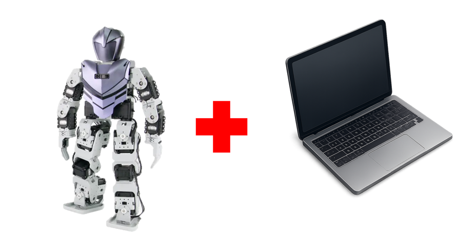
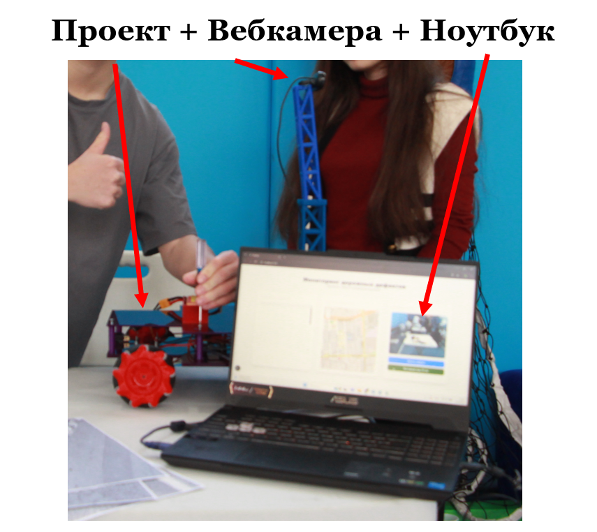
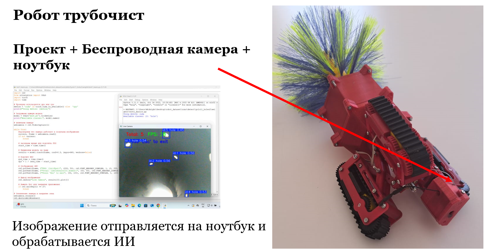
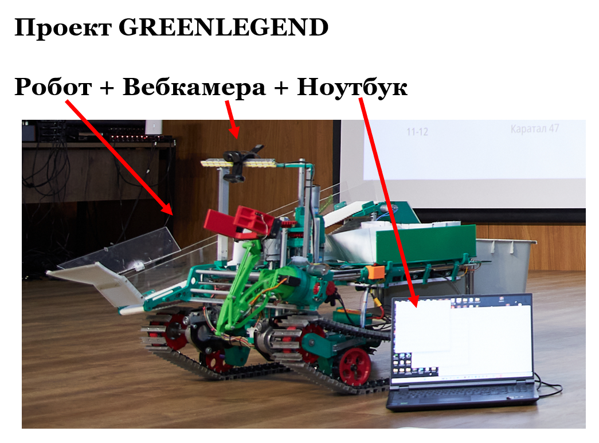
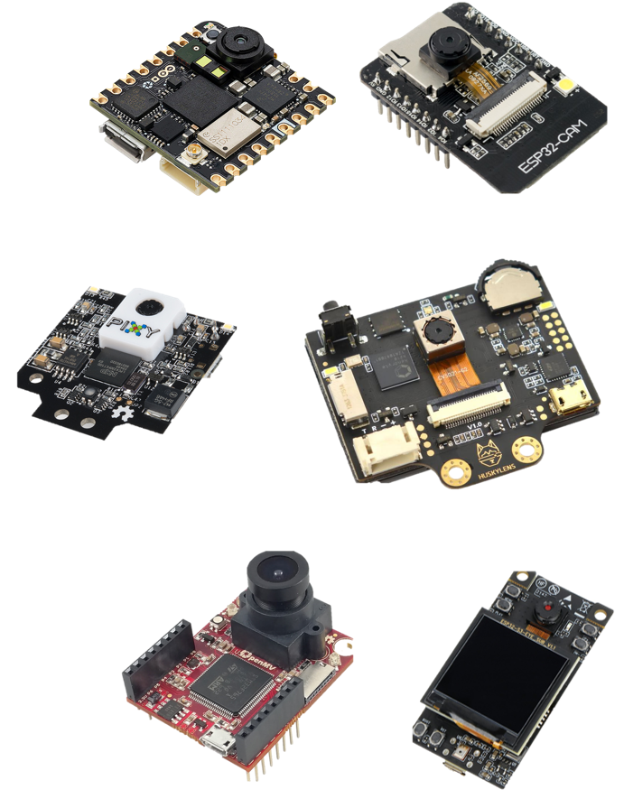
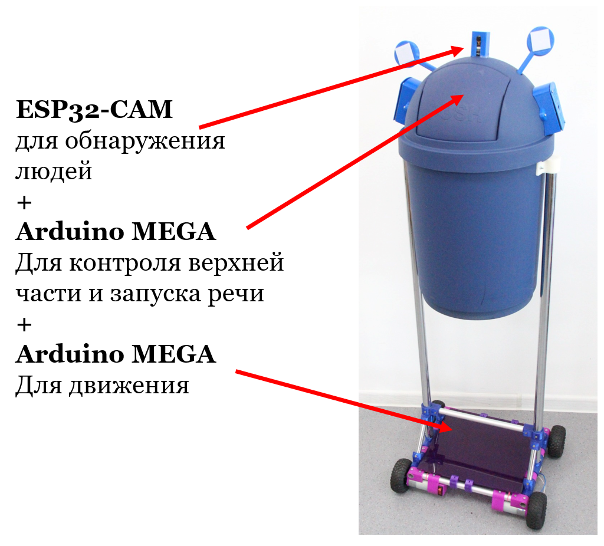
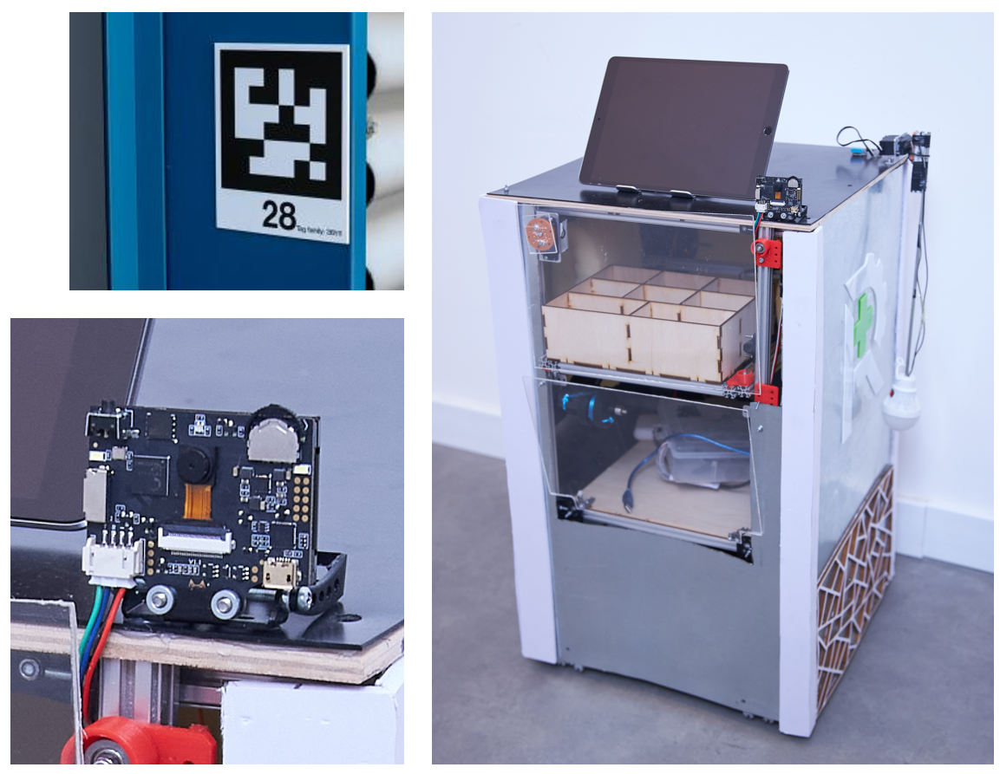
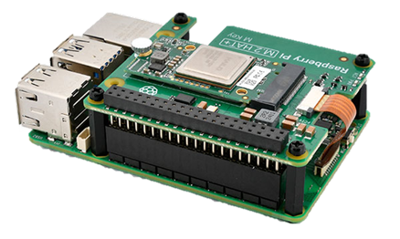
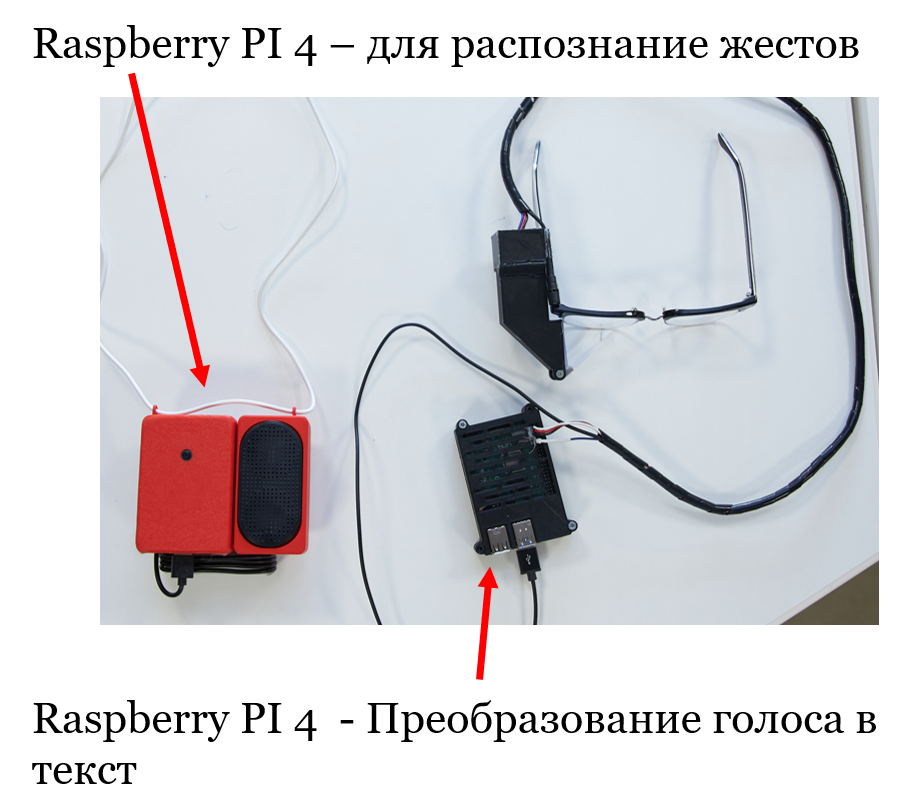
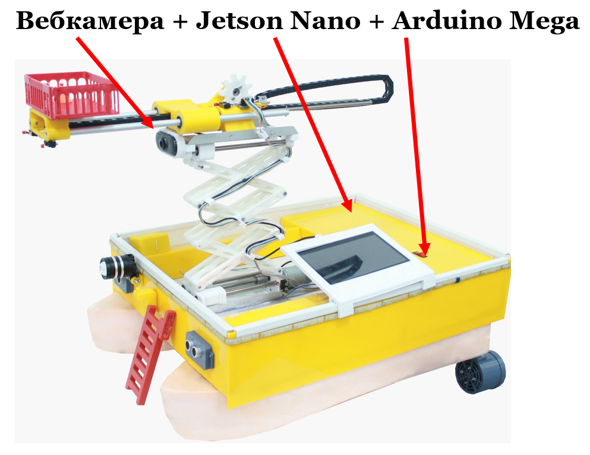

# Физические способы внедрения

## 1. Имитация

Отдельно создается тело проекта и отдельно ИИ на ноутбуке. Для демонстрации используется встроенная камера ноутбука (или микрофон). Обычно это делается на начальных этапах разработки, на уровне городских/областных конкурсов. 
Во время выступления рассказывают о дальнейшей интеграции. 
  

## 1.1 Имитация+

Также отдельно создается тело проекта и отдельно ИИ на ноутбуке, но вместо камеры на ноутбуке используется USB вебкамера или беспроводная камера.  
Пример 1:  
  
Пример 2:  

## 2. Связь кода с железом
ИИ также находиться на ноутбуке, вебкамера находиться на роботе и подключена к ноутбуку. Но также Arduino (или любое другое железо робота) подключено ноутбуку. Скрипт ИИ обрабатывает данные и отправляет в Arduino.

Пример 1:  
При обнаружении мусора на пути движения, программа отправляет сигнал на Arduino, которая управляет рукой и собирает мусор.

## 3. Слабое "железо"
Слабое "железо" - это разного рода специализированные платы имеющие встроенный ИИ функционал.
Например:
- ESP32-CAM
- Pixy 
- Huskylens 
- OpenMV Cam
- Arduino Nicla Vision
- ESP32-S3-EYE    

    

Чаще всего они обрабатывают данные и отправляют их на плату Arduino на роботе.

Пример 1: Робот – Умная мусорка.  
ESP32-CAM — недорогая плата на ESP32 с разъёмом под камеру Wi-Fi/BLE и слотом microSD.  
ESP-WHO — открытый фреймворк Espressif для компьютерного зрения на ESP32/ESP32-S3.

  

Пример 2: Проект Robocare с финала Samsung Solve for tomorrow 2025. 
Робот помощник использует Huskylens камеру для определения номеров палат по AprilTag.
 

## 4. Микрокомпьютеры

Можно использовать как отдельно для запуска ИИ в связке с Arduino, так и полностью управлять всем железом с них.
### Raspbery PI 4/5 + AI Kit также разные клоны Orange Pi 
Raspberry Pi - серия недорогих одноплатных компьютеров общего назначения, созданных Raspberry Pi Foundation для обучения и проектов. Используются как полноценные ПК и встраиваемые системы. 

Raspberry Pi AI Kit - комплект для Raspberry Pi 5: предустановленный модуль Hailo-8L на M.2 HAT+. Даёт до 13 TOPS для ускорения инференса нейросетей. Интегрирован в стек камер Raspberry Pi OS и автоматически задействуется в rpicam-apps.

Нативная поддержка в rpicam-apps для пост-обработки видео с камер. Подходит для детекции, сегментации, трекинга и др. в реальном времени.

 

### NVIDIA Jetson
NVIDIA Jetson™ — ведущая платформа для периферийного ИИ и робототехники, предлагающая мощные компактные компьютеры и комплект SDK NVIDIA JetPack™ для ускоренной разработки. JetPack предоставляет готовые программные сервисы для ускорения разработки сложных периферийных приложений ИИ, включая робототехнику, генеративный ИИ и компьютерное зрение. 

<table>
  <thead>
    <tr>
      <th>Серия / модель</th>
      <th>Примеры модулей и наборов</th>
      <th>ИИ-перф. (как у NVIDIA)</th>
      <th>Примечание</th>
    </tr>
  </thead>
  <tbody>
    <tr>
      <td>Jetson AGX Thor</td>
      <td>AGX Thor Dev Kit</td>
      <td>до 2070 TFLOPS FP4 (sparse)</td>
      <td>Blackwell, 128 GB, 40–130 Вт</td>
    </tr>
    <tr>
      <td>Jetson AGX Orin</td>
      <td>AGX Orin 64 GB / 32 GB / Industrial; Dev Kit</td>
      <td>до 275 TOPS</td>
      <td>15–60 Вт, топовая серия Orin</td>
    </tr>
    <tr>
      <td>Jetson Orin NX</td>
      <td>Orin NX 16 GB / 8 GB</td>
      <td>до 157 TOPS</td>
      <td>10–40 Вт, форм-фактор 70×45 мм</td>
    </tr>
    <tr>
      <td>Jetson Orin Nano</td>
      <td>Orin Nano 8 GB / 4 GB; Orin Nano Super Dev Kit</td>
      <td>до 67 TOPS (Super)</td>
      <td>JetPack 6.2 повысил предел с 40 до 67 TOPS</td>
    </tr>
    <tr>
      <td>Jetson AGX Xavier</td>
      <td>AGX Xavier 32 GB / 64 GB / Industrial</td>
      <td>32 TOPS (AGX), 30 TOPS (Industrial)</td>
      <td>Предыдущее поколение AGX</td>
    </tr>
    <tr>
      <td>Jetson Xavier NX</td>
      <td>Xavier NX 8 GB / 16 GB</td>
      <td>21 TOPS</td>
      <td>Малый форм-фактор 70×45 мм</td>
    </tr>
    <tr>
      <td>Jetson TX2 (семейство)</td>
      <td>TX2, TX2 4GB, TX2i, TX2 NX</td>
      <td>~1.3 TFLOPS FP16</td>
      <td>Pascal-GPU, 7.5–15 Вт</td>
    </tr>
    <tr>
      <td>Jetson TX1</td>
      <td>TX1</td>
      <td>~1 TFLOPS FP16</td>
      <td>Maxwell-GPU, 4 GB LPDDR4</td>
    </tr>
    <tr>
      <td>Jetson Nano</td>
      <td>Nano Module; Nano Dev Kit</td>
      <td>472 GFLOPS FP16</td>
      <td>Maxwell-GPU, 4 GB LPDDR4</td>
    </tr>
  </tbody>
</table>

Подробнее о [Jetson Nano](jetson.md)

Пример 1: Проект Soyle с финала Samsung solve for tomorrow 2025. Проекты полностью работают на Raspberry PI. В одном устройстве устная речь с микрофона преобразуется в текст на экране очков. В другом, камера распознает язык жестов и преобразует в звук.
 

Пример 2: Проект – лодка спасатель. При обнаружении человека Jetson Nano передает координаты человека в кадре по UART в Arduino. В зависимости от этого лодка меняет свой маршрут.

 

