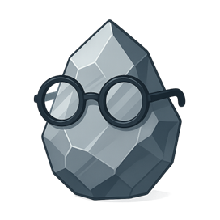

# Использование ИИ в робототехнике

На данной странице вы можете найти информацию о том как добавить ИИ в том или ином виде в ваш проект.

ИИ — это когда мы взяли бездушный камень (кремний), прикрутили к нему куски меди, заставили складывать нули и единицы, а потом начали на полном серьёзе спрашивать у калькулятора совета по жизни.

#### Что даёт ИИ в проекте:
- уникальные свойства (зрение, слух и т.д.)
- плюс к престижу проекта 

#### ИИ в проекте **не является** обязательным, оно:  
- добавляет сложность
- делает проект дороже
- увеличивает время создания проекта
- требует хотя бы минимального знания python
- для тренеровки ИИ требуется мощное железо

### Какие ИИ используют в проектах?
На практике в конкурсах встречаются: 
- 95% — компьютерное зрение (CV)
- 4% — распознавание речи
- 1% — узкоспециализированный ИИ (ANI)

**Компьютерное зрение** - это область ИИ, где машины извлекают полезную информацию из изображений и видео и используют её для действий.  
**Вход:** кадры камер, фото, глубина, LiDAR.  
**Вычисления:** фильтры, признаки, сверточные сети, трансформеры, геометрия. 	
**Выход:** что и где на сцене, как это движется, как с этим взаимодействовать.

  

Простейший вариант использования компьютерного зрения - [YOLO](yolo.md).

**Распознавание речи** — автоматический процесс преобразования речевого сигнала в цифровую информацию (например, текстовые данные). 

  

**Узкоспециализированный ИИ** — это система, обученная выполнять одну чётко ограниченную задачу в одном домене и не переносить навыки за его пределы.