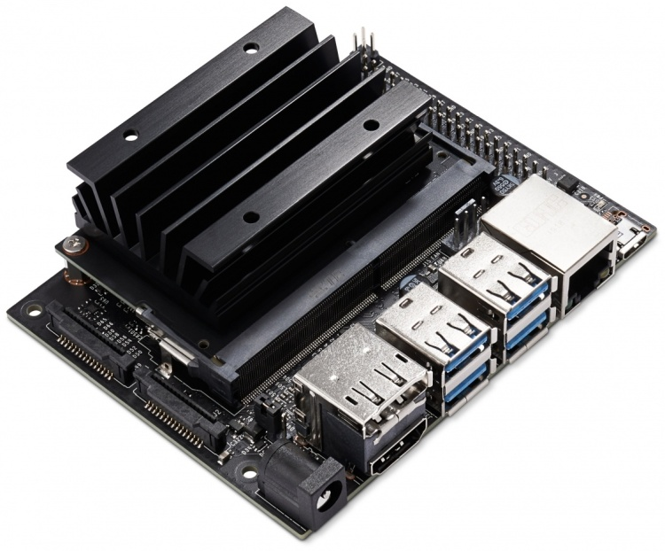
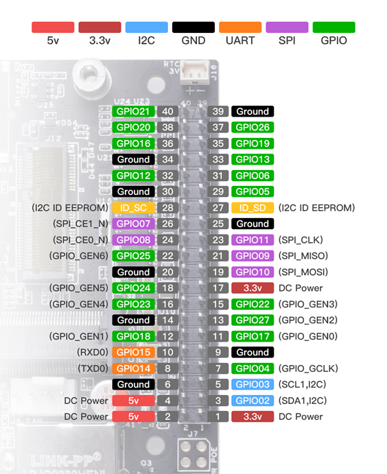
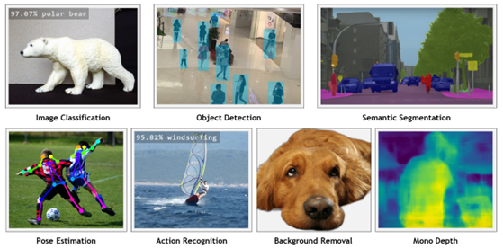

# Jetson Nano
  

**Jetson Nano:** базовый одноплатный компьютер NVIDIA для использования ИИ. 

- Работает на SoC Tegra Х1
- 2 или 4 Гб оперативной памяти
- Операционная система - JetPack (Ubuntu 18.04)
- Загружается с microSD, SSD или eMMC
- Потребляет 5–10 Вт. 
- USB, HDMI, Ethernet порты
- 40-контактный GPIO-разъём
- Поддержка UART, I2C, SPI, 2 ШИМ порта

 

## Установка

**NVIDIA JetPack™** — это официальный программный стек для платформы NVIDIA Jetson™, предоставляющий вам комплексный набор инструментов и библиотек для разработки периферийных приложений на базе ИИ.

Официальная инструкция [https://developer.nvidia.com/embedded/learn/get-started-jetson-nano-devkit](https://developer.nvidia.com/embedded/learn/get-started-jetson-nano-devkit)

Официальная инструкция для NANO 4GB [https://www.yahboom.net/study/jetson-nano](https://www.yahboom.net/study/jetson-nano)

## Jetson Inference
[**Jetson Inference**](https://github.com/dusty-nv/jetson-inference) — это библиотека и набор примеров для Jetson, упрощающие инференс моделей компьютерного зрения с ускорением TensorRT через API C++/Python.

