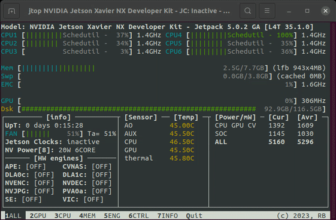

# Jetson Nano
  

**Jetson Nano:** базовый одноплатный компьютер NVIDIA для использования ИИ. 

- Работает на SoC Tegra Х1
- 2 или 4 Гб оперативной памяти
- Операционная система - JetPack (Ubuntu 18.04)
- Загружается с microSD, SSD или eMMC
- Потребляет 5–10 Вт. 
- USB, HDMI, Ethernet порты
- 40-контактный GPIO-разъём
- Поддержка UART, I2C, SPI, 2 ШИМ порта

 

## Установка

**NVIDIA JetPack™** — это официальный программный стек для платформы NVIDIA Jetson™, предоставляющий вам комплексный набор инструментов и библиотек для разработки периферийных приложений на базе ИИ.

Официальная инструкция [https://developer.nvidia.com/embedded/learn/get-started-jetson-nano-devkit](https://developer.nvidia.com/embedded/learn/get-started-jetson-nano-devkit)

Официальная инструкция для NANO 4GB [https://www.yahboom.net/study/jetson-nano](https://www.yahboom.net/study/jetson-nano)  

После установки обязательно:
> sudo apt update  
> sudo apt upgrade

## jtop
jtop - лучший инструмент для мониторинга устройств NVIDIA Jetson. [Статья с обзором.](https://jetsonhacks.com/2023/02/07/jtop-the-ultimate-tool-for-monitoring-nvidia-jetson-devices/)  

 

Установка:

> sudo apt update
> sudo apt install python3-pip

После установки pip:
> sudo pip3 install -U jetson-stats

После того как pip установит пакет jetson-stats, вам потребуется выйти/войти в систему или перезагрузить Jetson.  
После перезагрузки, чтобы запустить jtop, откройте Терминал и выполните:
> jtop

## Python + conda
По умолчанию в JetPack стоят python 2.6 и python 3.6. Установка библиотек или попытки обновить версию python могут вызвать ошибки или сломать систему. Для безопасного программирования используется Miniforge.   

[Miniforge](https://github.com/conda-forge/miniforge) — это установщик Conda для ARM-устройств (Jetson, Raspberry Pi).   
Conda — это инструмент:
- Менеджер пакетов: ставит и удаляет библиотеки (как apt или pip).  
- Менеджер окружений: создаёт отдельные папки с разными версиями Python и библиотек. Они не мешают друг другу.    

Miniforge даёт возможность ставить новый Python (3.8, 3.9, 3.10) в изолированные окружения, не ломая JetPack. Создаёт папку ~/miniforge3/, где хранятся все окружения.

> wget https://github.com/conda-forge/miniforge/releases/latest/download/Miniforge3-Linux-aarch64.sh  
> bash Miniforge3-Linux-aarch64.sh

Перезагрузка, потом создание 

>conda create -n py39 python=3.9  

>conda activate py39

Чтобы отключить нужно написать

>conda deactivate py39

Для проверки созданных окружений

>conda info --envs

## Увеличение SWAP (Оперативной памяти)
Jetson Nano имеет 2 или 4 Gb оперативной памяти. Это очень мало. Для компенсации этого используется swap.   
swap — это участок памяти (файл или раздел на диске), который Linux использует как «виртуальное продолжение» оперативной памяти. swap работает медленнее чем настоящая оперативная память, но работа со swap быстрее чем без него.   
### Увеличение размера SWAP
Проверить текущий swap  
> free -h

Выключить текущий swap

>sudo swapoff -a

Удалить старый swap-файл (если есть)

>sudo rm /swapfile

Создать новый swap-файл нужного размера
Например, для 6 ГБ:

>sudo fallocate -l 6G /var/swapfile

Выставить права

>sudo chmod 600 /var/swapfile

Разметить как swap

>sudo mkswap /var/swapfile

Включить swap

>sudo swapon /var/swapfile

Проверить swap  
> free -h

Или использовать jtop.

## OpenCV
По умолчанию в JetPack стоит старая версия OpenCV 4.1.1.(2019 года). Для адекватной работы с OpenCV следует установить новейшие версии. НО! Для JetPack 4.6 нет готовых пакетов OpenCV, чтобы просто скачать и установить. Нужно будет собирать OpenCV с нуля.   
[Статья с полной инструкцией](https://qengineering.eu/install-opencv-on-jetson-nano.html)   
[Github](https://github.com/Qengineering/Install-OpenCV-Jetson-Nano)

Запустить conda

>conda activate py39

Перейти в папку загрузок

>cd Downloads

Скачать через wget:

> wget https://github.com/Qengineering/Install-OpenCV-Jetson-Nano/blob/main/OpenCV-4-13-0.sh

(Или скачать напрямую [github](https://github.com/Qengineering/Install-OpenCV-Jetson-Nano/blob/main/OpenCV-4-13-0.sh))

запустить скрипт 
> sudo bash Install*

Скрипт будет работать 3-4 часа.

## Jetson Inference
[**Jetson Inference**](https://github.com/dusty-nv/jetson-inference) — это библиотека и набор примеров для Jetson, упрощающие инференс моделей компьютерного зрения с ускорением TensorRT через API C++/Python.

Видеоуроки от NVIDIA:  
> [https://www.youtube.com/watch?v=jSKHeYVcAB8&list=PL5B692fm6--uQRRDTPsJDp4o0xbzkoyf8](https://www.youtube.com/watch?v=jSKHeYVcAB8&list=PL5B692fm6--uQRRDTPsJDp4o0xbzkoyf8)

Уроки именно по Jetson Inference начинаются с этого видео:  
> [https://www.youtube.com/watch?v=QXIwdsyK7Rw&list=PL5B692fm6--uQRRDTPsJDp4o0xbzkoyf8&index=9](https://www.youtube.com/watch?v=QXIwdsyK7Rw&list=PL5B692fm6--uQRRDTPsJDp4o0xbzkoyf8&index=9)

## Qengineering
[GitHub Qengineering](https://github.com/Qengineering) разные репозитории для Jetson Nano. [Сайт](https://qengineering.eu/)   
- Образ на Ubuntu 20.04 [https://github.com/Qengineering/Jetson-Nano-Ubuntu-20-image](https://github.com/Qengineering/Jetson-Nano-Ubuntu-20-image)  
- Кастомный образ [https://github.com/Qengineering/Jetson-Nano-image](https://github.com/Qengineering/Jetson-Nano-image)  
- Распознание лиц [https://github.com/Qengineering/Face-Recognition-Jetson-Nano](https://github.com/Qengineering/Face-Recognition-Jetson-Nano), в маске [https://github.com/Qengineering/Face-Recognition-with-Mask-Jetson-Nano](https://github.com/Qengineering/Face-Recognition-with-Mask-Jetson-Nano)  

