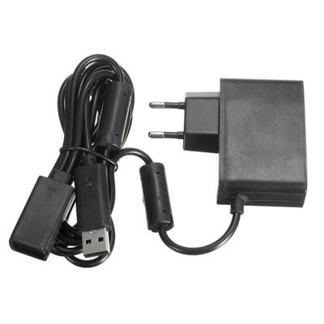

# Kinect
Kinect — бесконтактный сенсорный игровой контроллер, первоначально представленный для консоли Xbox 360, и значительно позднее для Xbox One и PC (Windows).  

Датчики Kinect v1 (Xbox 360 / Windows v1):
- RGB-камера 640×480@30 кадр/с.
- ИК-проектор точечного паттерна и ИК-камера, глубина ~320×240@30.
- Массив из 4 микрофонов.
- Привод наклона.

Инструкция только для Kinect v1. При подключении v1 должен отображаться как Xbox NUI Motor. 

### Переходник
Для подключения kinect к ноутбуку необходимо купить переходник:  

  

### Установка драйверов
Сначала [Kinect for Windows SDK v1.8](https://www.microsoft.com/en-us/download/details.aspx?id=40278).

Потом [Kinect for Windows Developer Toolkit v1.8](https://www.microsoft.com/en-us/download/details.aspx?id=40276)

### Проверка работы
Зайти в папку:
> C:\Program Files\Microsoft SDKs\Kinect\Developer Toolkit v1.8.0\Tools\

И запустить **ToolkitBrowser.exe**

Во вкладке Tools запустить (нажать на Run) Kinect Explorer-D2D. Будет показано изображение с камер ИК и RGB, показания акселерометра, возможность менять наклон камеры. 

