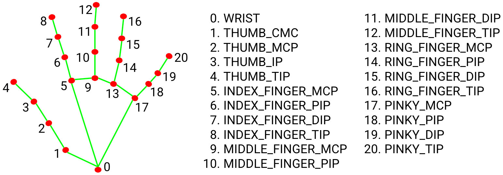

# Использование MediaPipe
MediaPipe Solutions предоставляет набор библиотек и инструментов, позволяющих быстро применять методы искусственного интеллекта (ИИ) и машинного обучения (МО) в ваших приложениях. Вы можете сразу подключить эти решения к своим приложениям, настроить их в соответствии со своими потребностями и использовать на нескольких платформах разработки.
Официальный сайт [MediaPipe](https://ai.google.dev/edge/mediapipe/solutions/guide?hl=ru)  

### Установка необходимого и первый запуск
##### 1. Python 3.9-3.12
- Скачать можно на официальном сайте [python.org](https://www.python.org/downloads/windows/).  
- Самые новые версии могут временно не поддерживаться YOLO.  
- Прямая ссылка на [Python 3.12.10](https://www.python.org/ftp/python/3.12.10/python-3.12.10-amd64.exe) (100% рабочая)
- При установке нужно устанавливать от имени администратора и поставить галочку в Add to PATH

##### 2. Установить нужные библиотеки
- в командную строку написать: 
> pip3 install mediapipe opencv-python

##### 3. Запустить тестовый скрип
Запустить python IDLE -> file -> new file  
Написать код и сохранить в любую папку  
Код находит и отслеживает положение рук и пальцев. [Полная статья](https://github.com/google-ai-edge/mediapipe/blob/master/docs/solutions/hands.md)

```
import cv2
import mediapipe as mp
import time

mp_hands = mp.solutions.hands
mp_draw  = mp.solutions.drawing_utils
mp_style = mp.solutions.drawing_styles

cap = cv2.VideoCapture(0)

with mp_hands.Hands(
    model_complexity=1,             # 0/1/2: сложность модели. Выше — точнее, но медленнее (по умолчанию 1)
    max_num_hands=4,                # максимум обнаруживаемых рук в кадре
    min_detection_confidence=0.5,   # порог уверенности для первичного детекта рук (0..1)
    min_tracking_confidence=0.5     # порог для продолжения трекинга; ниже — вернётся к детекту (0..1)
) as hands:
    while cv2.waitKey(1) != 27:
        
        ok, frame = cap.read()
        if not ok: break

        frame = cv2.flip(frame, 1)
        start_time = time.perf_counter()
        
        rgb = cv2.cvtColor(frame, cv2.COLOR_BGR2RGB)
        res = hands.process(rgb)

        if res.multi_hand_landmarks:
            for lm, hness in zip(res.multi_hand_landmarks, res.multi_handedness):
                mp_draw.draw_landmarks(
                    frame, lm, mp_hands.HAND_CONNECTIONS,
                    mp_style.get_default_hand_landmarks_style(),
                    mp_style.get_default_hand_connections_style()
                )
        
        end_time = time.perf_counter()
        fps = 1 / (end_time - start_time)
        cv2.putText(frame, f"FPS: {int(fps)}", (50, 90), cv2.FONT_HERSHEY_SIMPLEX, 1, (0, 255, 0), 2, cv2.LINE_AA)
        cv2.putText(frame, f"Press 'Esc' to exit", (50, 50), cv2.FONT_HERSHEY_SIMPLEX, 1, (255, 0, 0), 2, cv2.LINE_AA)

        cv2.imshow("Hands", frame)

cap.release()
cv2.destroyAllWindows()

```

 

#### Примеры

##### Facemesh

MediaPipe Face Mesh — это решение, которое оценивает 468 трёхмерных ориентиров лица в режиме реального времени, даже на мобильных устройствах. [Полная статья](https://github.com/google-ai-edge/mediapipe/blob/master/docs/solutions/face_mesh.md)  

<details>
<summary>Face mesh</summary>

```

import cv2
import mediapipe as mp
import time

mp_face  = mp.solutions.face_mesh
mp_draw  = mp.solutions.drawing_utils
mp_style = mp.solutions.drawing_styles

cap = cv2.VideoCapture(0)

with mp_face.FaceMesh(
    static_image_mode=False,        # потоковое видео; True — для обработки отдельных фото
    max_num_faces=4,                # максимум обнаруживаемых лиц в кадре
    refine_landmarks=True,          # детализированные точки (радужка, губы)
    min_detection_confidence=0.5,   # порог уверенности первичного детекта (0..1)
    min_tracking_confidence=0.5     # порог продолжения трекинга (0..1)
) as face:
    while cv2.waitKey(1) != 27:

        ok, frame = cap.read()
        if not ok:
            break

        frame = cv2.flip(frame, 1)
        start_time = time.perf_counter()

        rgb = cv2.cvtColor(frame, cv2.COLOR_BGR2RGB)
        res = face.process(rgb)

        if res.multi_face_landmarks:
            for lm in res.multi_face_landmarks:
                # Треугольная сетка лица
                mp_draw.draw_landmarks(
                    frame, lm, mp_face.FACEMESH_TESSELATION,
                    landmark_drawing_spec=None,
                    connection_drawing_spec=mp_style.get_default_face_mesh_tesselation_style()
                )
                # Контуры лица
                mp_draw.draw_landmarks(
                    frame, lm, mp_face.FACEMESH_CONTOURS,
                    landmark_drawing_spec=None,
                    connection_drawing_spec=mp_style.get_default_face_mesh_contours_style()
                )
                # Радужки глаз
                mp_draw.draw_landmarks(
                    frame, lm, mp_face.FACEMESH_IRISES,
                    landmark_drawing_spec=None,
                    connection_drawing_spec=mp_style.get_default_face_mesh_iris_connections_style()
                )

        end_time = time.perf_counter()
        fps = 1.0 / max(1e-6, (end_time - start_time))
        cv2.putText(frame, f"FPS: {int(fps)}", (50, 90),
                    cv2.FONT_HERSHEY_SIMPLEX, 1, (0, 255, 0), 2, cv2.LINE_AA)
        cv2.putText(frame, "Press 'Esc' to exit", (50, 50),
                    cv2.FONT_HERSHEY_SIMPLEX, 1, (255, 0, 0), 2, cv2.LINE_AA)

        cv2.imshow("Face Mesh", frame)

cap.release()
cv2.destroyAllWindows()

```

</details>
<br>

Маска очков на лицо. В папку с кодом загрузить файл  
> [glasses.png](img/glasses.png)

<details>
<summary>Очки</summary>

```

import cv2
import mediapipe as mp
import numpy as np
import time, math, os

mp_face  = mp.solutions.face_mesh
mp_draw  = mp.solutions.drawing_utils
mp_style = mp.solutions.drawing_styles

# ==== Параметры ====
PNG_PATH = "glasses.png"       # Опционально: PNG c альфа-каналом (очки), центр в середине файла
TINT_ALPHA = 0.35              # Прозрачность затемнения "линз" (0..1)
FRAME_THICK = 4                # Толщина контура "оправы" (px)
SCALE_W = 3                  # Ширина очков = IPD * SCALE_W
SCALE_H = 0.45                 # Относительная высота очков от ширины

cap = cv2.VideoCapture(0)

# Загрузка PNG, если есть
png_rgba = None
if os.path.isfile(PNG_PATH):
    png_rgba = cv2.imread(PNG_PATH, cv2.IMREAD_UNCHANGED)

def alpha_blend_rgba(bg_bgr, fg_rgba, cx, cy):
    """Альфа-наложение RGBA поверх bg, центрируя в (cx,cy)."""
    fh, fw = fg_rgba.shape[:2]
    x1 = int(cx - fw // 2); y1 = int(cy - fh // 2)
    x2 = x1 + fw;          y2 = y1 + fh

    # Клип по границам
    bh, bw = bg_bgr.shape[:2]
    x1c, y1c = max(0, x1), max(0, y1)
    x2c, y2c = min(bw, x2), min(bh, y2)
    if x1c >= x2c or y1c >= y2c: 
        return

    roi_bg = bg_bgr[y1c:y2c, x1c:x2c]
    roi_fg = fg_rgba[(y1c - y1):(y2c - y1), (x1c - x1):(x2c - x1)]

    alpha = (roi_fg[..., 3:4].astype(np.float32)) / 255.0
    fg_bgr = roi_fg[..., :3].astype(np.float32)
    bg_bgr[y1c:y2c, x1c:x2c] = (alpha * fg_bgr + (1 - alpha) * roi_bg.astype(np.float32)).astype(np.uint8)

def rotate_scale_rgba(img_rgba, angle_deg, scale):
    """Поворот и масштаб RGBA."""
    h, w = img_rgba.shape[:2]
    M = cv2.getRotationMatrix2D((w/2, h/2), angle_deg, scale)
    out = cv2.warpAffine(img_rgba, M, (w, h), flags=cv2.INTER_LINEAR, borderMode=cv2.BORDER_TRANSPARENT)
    return out

def iris_center_px(lm_list, ids, W, H):
    xs = [lm_list[i].x * W for i in ids]
    ys = [lm_list[i].y * H for i in ids]
    return (float(np.mean(xs)), float(np.mean(ys)))

with mp_face.FaceMesh(
    static_image_mode=False,        
    max_num_faces=2,                
    refine_landmarks=True,          # даёт 5 точек радужки на каждый глаз (всего 478)
    min_detection_confidence=0.5,
    min_tracking_confidence=0.5
) as face:
    while cv2.waitKey(1) != 27:
        ok, frame = cap.read()
        if not ok: break

        frame = cv2.flip(frame, 1)
        start_time = time.perf_counter()

        rgb = cv2.cvtColor(frame, cv2.COLOR_BGR2RGB)
        rgb.flags.writeable = False
        res = face.process(rgb)
        rgb.flags.writeable = True

        H, W = frame.shape[:2]

        if res.multi_face_landmarks:
            # Берём первое лицо
            lm = res.multi_face_landmarks[0].landmark

            # Индексы радужек (mediapipe, при refine_landmarks=True)
            right_iris = [469, 470, 471, 472, 468]  # правая (для пользователя — слева)
            left_iris  = [474, 475, 476, 477, 473]  # левая  (для пользователя — справа)

            # Центры радужек в пикселях
            rx, ry = iris_center_px(lm, right_iris, W, H)
            lx, ly = iris_center_px(lm, left_iris,  W, H)

            # Межзрачковое расстояние и угол наклона
            ipd = math.hypot(lx - rx, ly - ry)
            angle = -math.degrees(math.atan2(ly - ry, lx - rx))
            cx, cy = (rx + lx) * 0.5, (ry + ly) * 0.5

            # Масштаб по ширине
            target_w = max(1, int(ipd * SCALE_W))
            scale = target_w / png_rgba.shape[1]
            rotated = rotate_scale_rgba(png_rgba, angle, scale)
            alpha_blend_rgba(frame, rotated, int(cx), int(cy))
            
        end_time = time.perf_counter()
        fps = 1.0 / max(1e-6, (end_time - start_time))
        cv2.putText(frame, f"FPS: {int(fps)}", (50, 90),
                    cv2.FONT_HERSHEY_SIMPLEX, 1, (0, 255, 0), 2, cv2.LINE_AA)
        cv2.putText(frame, "Press 'Esc' to exit", (50, 50),
                    cv2.FONT_HERSHEY_SIMPLEX, 1, (255, 0, 0), 2, cv2.LINE_AA)

        cv2.imshow("FaceMesh Virtual Try-On", frame)

cap.release()
cv2.destroyAllWindows()

```

</details>
<br>

Измерение расстояния для лица. [Полная статья](https://github.com/google-ai-edge/mediapipe/blob/master/docs/solutions/iris.md)

<details>
<summary>Расстояние</summary>

```

import cv2
import mediapipe as mp
import time, math

# ==== Параметры ====
CALIB_DIST_M = 0.60           # метров: на каком расстоянии нажмёте 'C'
SMOOTH_ALPHA = 0.85           # 0..1, больше — плавнее (эксп. сглаживание)

mp_face  = mp.solutions.face_mesh
cap = cv2.VideoCapture(0)

calib_C = None                # константа масштаба = ipd_px_at_calib * CALIB_DIST_M
dist_smooth = None

# Индексы центра радужек (нужен refine_landmarks=True)
RIGHT_IRIS_CENTER = 468
LEFT_IRIS_CENTER  = 473

with mp_face.FaceMesh(
    static_image_mode=False,
    max_num_faces=1,
    refine_landmarks=True,      # включает точки радужки (всего 478)
    min_detection_confidence=0.5,
    min_tracking_confidence=0.5
) as face:

    while True:
        ok, frame = cap.read()
        if not ok: break

        frame = cv2.flip(frame, 1)
        start = time.perf_counter()

        rgb = cv2.cvtColor(frame, cv2.COLOR_BGR2RGB)
        rgb.flags.writeable = False
        res = face.process(rgb)
        rgb.flags.writeable = True

        H, W = frame.shape[:2]
        ipd_px = None

        if res.multi_face_landmarks:
            lm = res.multi_face_landmarks[0].landmark

            # Берём центры радужек
            rx, ry = lm[RIGHT_IRIS_CENTER].x * W, lm[RIGHT_IRIS_CENTER].y * H
            lx, ly = lm[LEFT_IRIS_CENTER].x  * W, lm[LEFT_IRIS_CENTER].y  * H

            ipd_px = math.hypot(lx - rx, ly - ry)

            # Визуализация центров
            cv2.circle(frame, (int(rx), int(ry)), 3, (0,255,255), -1, cv2.LINE_AA)
            cv2.circle(frame, (int(lx), int(ly)), 3, (0,255,255), -1, cv2.LINE_AA)
            cv2.line(frame, (int(rx), int(ry)), (int(lx), int(ly)), (0,255,255), 2, cv2.LINE_AA)

        # Оценка дистанции
        if calib_C is not None and ipd_px and ipd_px > 1:
            dist_m = calib_C / ipd_px                 # d ≈ (s0*d0)/s
            if dist_smooth is None:
                dist_smooth = dist_m
            else:
                dist_smooth = SMOOTH_ALPHA*dist_smooth + (1-SMOOTH_ALPHA)*dist_m
            text = f"Distance: {dist_smooth:.2f} m"
        else:
            text = "Press 'C' at known distance"

        # HUD
        end = time.perf_counter()
        fps = 1.0 / max(1e-6, (end - start))
        cv2.putText(frame, f"FPS: {int(fps)}", (20, 40),
                    cv2.FONT_HERSHEY_SIMPLEX, 1, (0,255,0), 2, cv2.LINE_AA)
        cv2.putText(frame, text, (20, 80),
                    cv2.FONT_HERSHEY_SIMPLEX, 1, (255,255,0), 2, cv2.LINE_AA)
        if ipd_px:
            cv2.putText(frame, f"IPD px: {ipd_px:.1f}", (20, 120),
                        cv2.FONT_HERSHEY_SIMPLEX, 1, (255,0,255), 2, cv2.LINE_AA)
        if calib_C is not None:
            cv2.putText(frame, f"Calib C: {calib_C:.1f}", (20, 160),
                        cv2.FONT_HERSHEY_SIMPLEX, 1, (0,200,255), 2, cv2.LINE_AA)
        cv2.putText(frame, "C=Calibrate  Esc=Exit", (20, H-20),
                    cv2.FONT_HERSHEY_SIMPLEX, 1, (200,200,200), 2, cv2.LINE_AA)

        cv2.imshow("Iris distance meter", frame)

        k = cv2.waitKey(1) & 0xFF
        if k == 27:  # Esc
            break
        elif k in (ord('c'), ord('C')):
            # Калибровка: на расстоянии CALIB_DIST_M нажмите 'C'
            if ipd_px and ipd_px > 1:
                calib_C = ipd_px * CALIB_DIST_M
                dist_smooth = None  # сброс фильтра

cap.release()
cv2.destroyAllWindows()

```

</details>
<br>