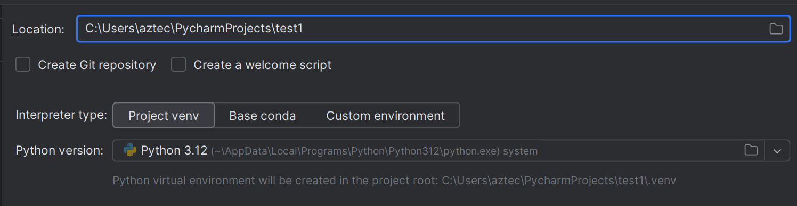
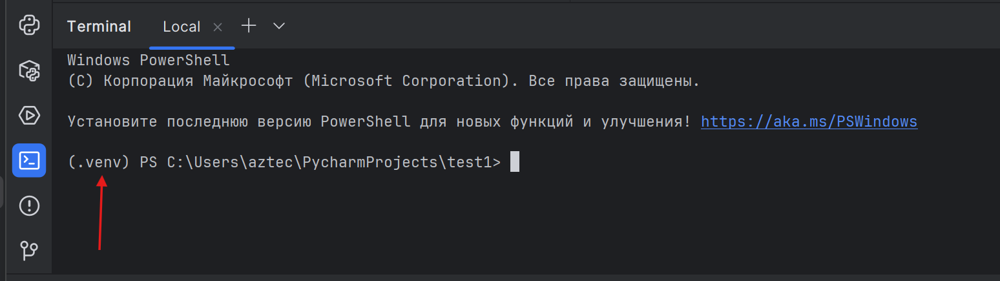
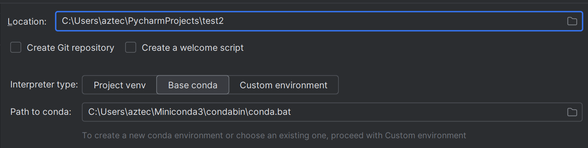
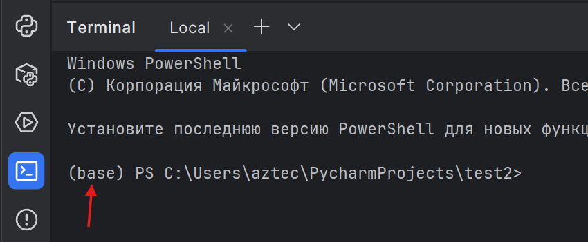
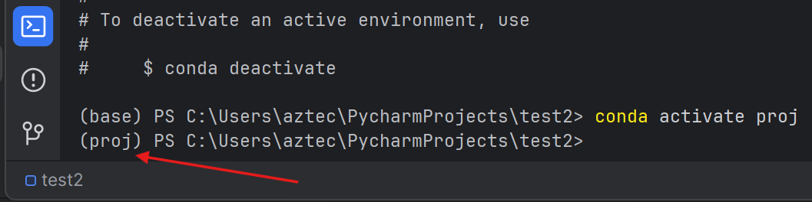
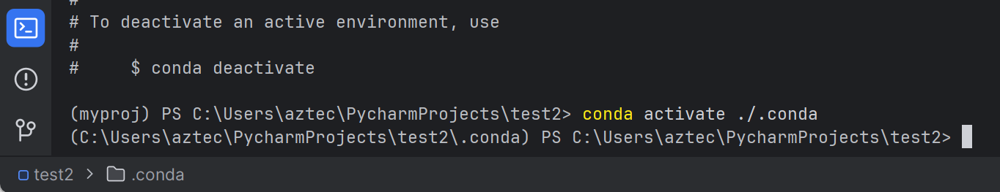
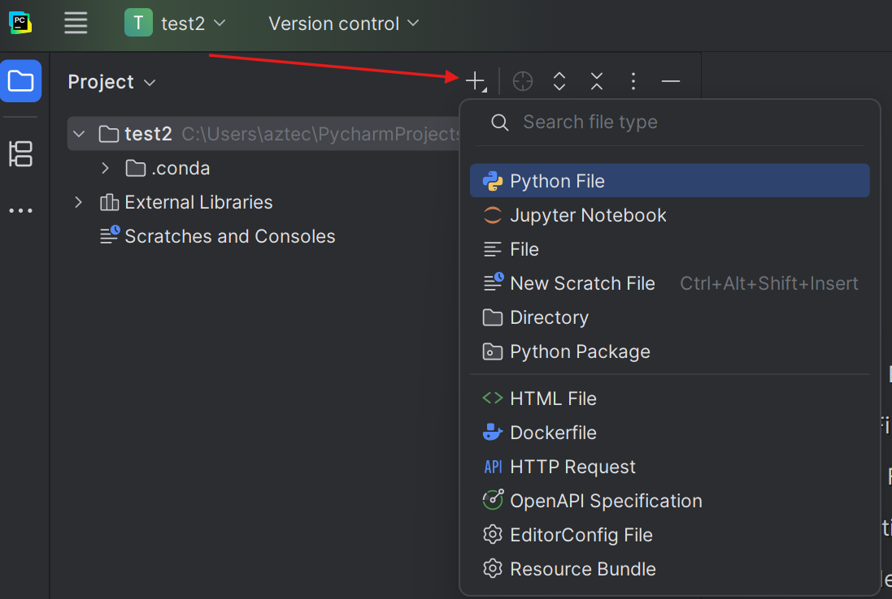
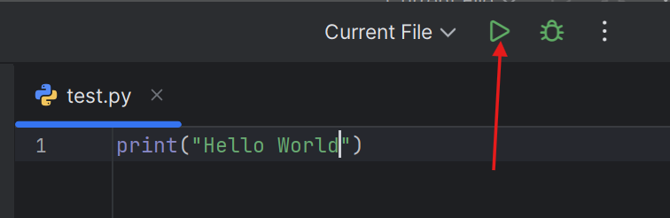

# PyCharm
**PyCharm** — кроссплатформенная интегрированная среда разработки для языка программирования Python, разработанная компанией JetBrains.  
- Основные функции бесплатные.  
- Есть учебная лицензия, но недоступна в Казахстане. :(  
Официальный сайт: [https://www.jetbrains.com/pycharm/](https://www.jetbrains.com/pycharm/)

## Установка
1. Скачать по ссылке [https://www.jetbrains.com/pycharm/download/](https://www.jetbrains.com/pycharm/download/)  
2. Установить. 🗿  

## PyCharm vs IDLE

<table>
  <thead>
    <tr>
      <th>Критерий</th>
      <th>PyCharm (единый с 2025.1)</th>
      <th>IDLE</th>
    </tr>
  </thead>
  <tbody>
    <tr>
      <td>Что это</td>
      <td>Полноценная IDE: проекты, навигация, интеграции</td>
      <td>Встроенная учебная среда: редактор + REPL</td>
    </tr>
    <tr>
      <td>Для кого</td>
      <td>Учёба и реальные проекты</td>
      <td>Первые шаги, маленькие скрипты</td>
    </tr>
    <tr>
      <td>Установка</td>
      <td>Отдельная установка; базовое ядро бесплатно; 30-дн. Pro-триал</td>
      <td>Ставится вместе с Python</td>
    </tr>
    <tr>
      <td>Подсветка и автодополнение</td>
      <td>Расширенные, с анализом кода</td>
      <td>Базовые</td>
    </tr>
    <tr>
      <td>Отладка</td>
      <td>Полный UI: брейкпоинты, шаги, watch</td>
      <td>Простой отладчик</td>
    </tr>
    <tr>
      <td>Тесты</td>
      <td>Интеграция pytest/unittest</td>
      <td>Ручной запуск</td>
    </tr>
    <tr>
      <td>Git и управление версиями</td>
      <td>Встроено</td>
      <td>Нет</td>
    </tr>
    <tr>
      <td>Виртуальные окружения</td>
      <td>Создание и привязка venv/conda</td>
      <td>Только вне IDLE</td>
    </tr>
    <tr>
      <td>Плагины / Marketplace</td>
      <td>Есть Marketplace</td>
      <td>Нет</td>
    </tr>
    <tr>
      <td>Jupyter</td>
      <td>Поддержка ноутбуков в бесплатной части</td>
      <td>Нет</td>
    </tr>
    <tr>
      <td>AI-функции</td>
      <td>JetBrains AI Assistant в Pro; расширенные функции по подписке</td>
      <td>Нет</td>
    </tr>
    <tr>
      <td>Итог</td>
      <td>Для серьёзной учёбы и работы</td>
      <td>Для старта и учебных примеров</td>
    </tr>
  </tbody>
</table>

## Виртуальные среды
**Виртуальная среда** — это «песочница» для проекта. Внутри лежит свой интерпретатор Python и свои пакеты. Проекты не конфликтуют друг с другом, а система остаётся чистой. Например, для одного проекта нужен Python 3.12 а для другого Python 3.9. Для каждого проекта создаётся своя виртуальная среда с нужной версией. То же самое касается версий библиотек. 

**Зачем это нужно:**    
- Разные проекты требуют разные версии библиотек.
- Легко повторить окружение на другом компьютере.
- Безопаснее экспериментировать: сломали среду — удалили папку, проект цел.

В **IDLE** нет возможности использовать виртуальные среды. В **PyCharm** при создании проекта есть возможность создать среду **venv** или **conda.**

### venv
**venv** — стандартный и лёгкий. Подходит для большинства задач: веб-проект, скрипты, обучение. Идёт вместе с Python.

```

# Windows (PowerShell)
py -3.12 -m venv .venv
.\.venv\Scripts\Activate.ps1

# Windows (Cmd)
py -3.12 -m venv .venv
.\.venv\Scripts\activate.bat

# macOS / Linux
python3 -m venv .venv
source .venv/bin/activate

```

Работа внутри среды

```

python -m pip install --upgrade pip
pip install <пакет>
pip freeze > requirements.txt          # зафиксировать зависимости
pip install -r requirements.txt        # восстановить на другом ПК
deactivate

```

Когда выбрать venv: нужен простой, быстрый старт без тяжёлых нативных зависимостей.   
В **PyCharm** при создании проекта просто нужно выбрать версию python (можно установить нужную версию прямо там).  

   

Будет создана папка .venv  

   

В терминале будет показано **(.venv)** если среда активирована. При запуске проекта среда активируется автоматически.  

  

Можно создать несколько сред, но это **НЕ рекомендуется** делать.


### conda
**conda** — менеджер окружений + пакетов. Сильная сторона — научный стек, пакеты с C/Fortran, CUDA/GPU, а также не только Python.
Существует Miniconda, mamba или Anaconda. Сам **PyCharm** предлагает установить **Miniconda** - то лучший вариант.

<details>
<summary>Разница</summary> 

- Anaconda  
«Толстая» сборка: conda + Navigator + сотни пакетов сразу. Плюс — можно работать офлайн «из коробки». Минусы — вес и долгие обновления.  

- Miniconda  
Минимальный установщик: conda + Python. Ставите только нужное. Плюсы — лёгкая, чистая. Минус — всё докачивать самим. Navigator ставится отдельно при желании.  

- mamba  
Быстрая замена командам conda (тот же формат команд). Решает зависимости быстрее и качает параллельно. Ставится в тот же base или берите дистрибутивы с mamba сразу.  

- Miniforge / Mambaforge  
Мини-сборки с mamba и каналом conda-forge по умолчанию. Удобно, если живёте на conda-forge.  

</details>

   
  
  

Создание отдельного окружения:  
Вариант 1:
```
Среда создаётся в папке самой conda, например C:\Users\aztec\miniconda3\envs  
conda create -n proj python=3.12
conda activate proj
conda deactivate #декативировать
```
  

Или вариант 2:
```
Среда создаётся в папке проекта
conda create -p .\.conda python=3.12
conda activate .\.conda
conda deactivate #декативировать
```
  

## Начало работы
- Создать файлы

 

- Написать код  
- Запустить код

 

<br>