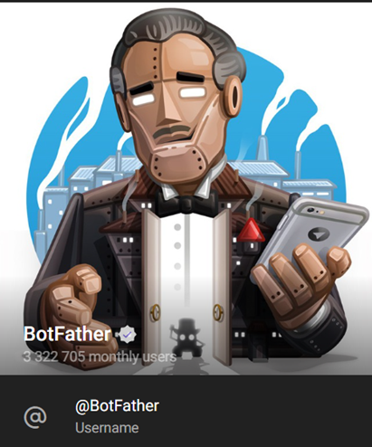
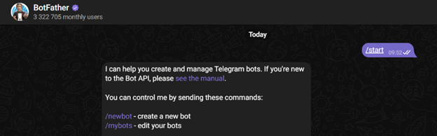
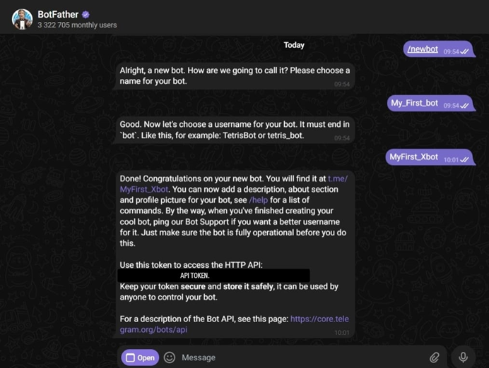

# Создание телеграм бота и связка с ИИ

Телеграм бот это прикольно

### Создание бота  

- Заходим в Telegram- бота @BotFather.  
  

-	Затем нажимаем «start» и из предложенного списка выбираем команду /newbot.

- Вводим имя и ник вашего Telegram-бота. Ник должен оканчиваться на _bot

