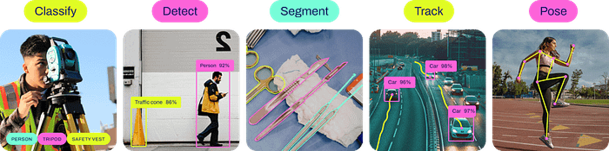

# Использование Ultralytics YOLO
Ultralytics YOLO — это открытая библиотека на Python для обучения и применения моделей YOLO предназначенных для задач компьютерного зрения: обнаружение объектов, сегментация, классификация.
Официальный сайт [Ultralytics YOLO.](https://docs.ultralytics.com/ru/)  

### Установка необходимого и первый запуск
##### 1. Python 3.10 и выше
- Скачать можно на официальном сайте [python.org](https://www.python.org/downloads/windows/).  
- Самые новые версии могут временно не поддерживаться YOLO.  
- Прямая ссылка на [Python 3.13.2](https://www.python.org/ftp/python/3.13.2/python-3.13.2-amd64.exe) (100% рабочая)

##### 2. Установить драйверы NVIDIA (Только если есть видеокарта NVIDIA RTX)

- CUDA Toolkit [https://developer.nvidia.com/cuda-downloads](https://developer.nvidia.com/cuda-downloads)
-  cuDNN [https://developer.nvidia.com/cudnn-downloads](https://developer.nvidia.com/cudnn-downloads)

Выбирать версии для Windows 11.

##### 3. Установить pytorch
- Выбрать нужную версию [здесь](https://pytorch.org/get-started/locally/) и установить через командную строку. (Win + R, cmd)  
Например: pip3 install torch torchvision torchaudio --index-url [https://download.pytorch.org/whl/cu129](https://download.pytorch.org/whl/cu129)

##### 4. Установить нужные библиотеки
- в командную строку написать: pip3 install ultralytics opencv-python

##### 5. Скачать предобученную модель
- для первого примера скачать YOLO11n из [https://docs.ultralytics.com/ru/tasks/detect/](https://docs.ultralytics.com/ru/tasks/detect/)
Больше моделей и датасетов [https://docs.ultralytics.com/ru/datasets/](https://docs.ultralytics.com/ru/datasets/))

##### 6. Запустить тестовый скрип
Запустить python IDLE -> file -> new file
Написать код и сохранить в папку со скаченной моделью YOLO11n
```
import cv2
from ultralytics import YOLO
import torch
import time

# Проверка используется gpu или cpu
device = 'cuda' if torch.cuda.is_available() else  'cpu'
print(f"Using device: {device}")

# Загружаем нужную модель
model = YOLO('yolo11n.pt').to(device)
print("Available classes:", model.names)

# включаем камеру
webcamera = cv2.VideoCapture(0)

while True:
    #проверяем что камера работает и получаем изображение
    success, frame = webcamera.read()
    if not success:
        break

    # засекаем время для подсчёта FPS
    start_time = time.time()

    # Применяем модель на кадр
    results = model.track(frame, conf=0.8, imgsz=640)

    # Подсчёт ФПС
    end_time = time.time()
    fps = 1 / (end_time - start_time)

    # Отображение ФПС
    cv2.putText(frame, f"FPS: {int(fps)}", (200, 50), cv2.FONT_HERSHEY_SIMPLEX, 1, (0, 255, 0), 2, cv2.LINE_AA)
    cv2.putText(frame, f"Total: {len(results[0].boxes)}", (50, 50), cv2.FONT_HERSHEY_SIMPLEX, 1, (0, 0, 255), 2, cv2.LINE_AA)
    cv2.putText(frame, f"Press 'Esc' to exit", (50, 100), cv2.FONT_HERSHEY_SIMPLEX, 1, (255, 0, 0), 2, cv2.LINE_AA)

    # Вывод изображения
    cv2.imshow("Live Camera", results[0].plot())

    # Нажать Esc для закрытия приложения
    if cv2.waitKey(1) == 27:
        break

# Отключение камеры и закрытие окна
webcamera.release()
cv2.destroyAllWindows()
```

Для смены камеры меняем цифру в строке 
``` webcamera = cv2.VideoCapture(0) ```  

Python скрипт для проверки списка камер:
```
import cv2
for i in range(10):
    cap=cv2.VideoCapture(i, cv2.CAP_DSHOW)
    ok=cap.isOpened()
    cap.release()
    if ok: print(i) 
```
Либо через командную строку:  
```wmic path Win32_PnPEntity where "PNPClass='Camera' OR PNPClass='Image'" get Name,DeviceID```

##### Бонус:
Сокращённая версия кода
```
import cv2
from ultralytics import YOLO
model = YOLO('yolo11m-pose.pt').to('cuda')
wc = cv2.VideoCapture(0)

while cv2.waitKey(1) != 27:
    results = model.track(wc.read()[1], conf=0.8, imgsz=640, verbose=False)
    cv2.imshow("Live Camera", results[0].plot())

wc.release(); cv2.destroyAllWindows()
```
### YOLO v11 имеет разные тренированные модели

 

ChatGPT сказал:

**Classify** — задача классификации изображений. Определяет один класс для всего изображения (или кропа).  
**Detect** — задача обнаружения объектов. Находит каждый объект и присваивает класс, обрамляя прямоугольным bbox.  
**Segment** — задача сегментации экземпляров. Находит каждый объект, присваивает класс и выдает пиксельную маску его контура (часто вместе с bbox).  
**Track** — задача трекинга объектов во времени. Присваивает устойчивые ID уже найденным объектам в видеопотоке, связывая их между кадрами.  
**Pose** — задача оценки позы. Находит объект (обычно человека) и предсказывает координаты ключевых точек скелета (часто вместе с bbox и классом).  
**OBB** — задача обнаружения с повернутыми рамками. Находит объект, присваивает класс и выдает ориентированный прямоугольник (bbox с углом).  

<table>
  <thead>
    <tr>
      <th>Модель</th>
      <th>Имена файлов</th>
      <th>Задача</th>
    </tr>
  </thead>
  <tbody>
    <tr>
      <td>YOLO11</td>
      <td>
        <code>yolo11n.pt</code>
        <code>yolo11s.pt</code>
        <code>yolo11m.pt</code>
        <code>yolo11l.pt</code>
        <code>yolo11x.pt</code>
      </td>
      <td><a href="https://docs.ultralytics.com/ru/tasks/detect/">Обнаружение</a></td>
    </tr>
    <tr>
      <td>YOLO11-seg</td>
      <td>
        <code>yolo11n-seg.pt</code>
        <code>yolo11s-seg.pt</code>
        <code>yolo11m-seg.pt</code>
        <code>yolo11l-seg.pt</code>
        <code>yolo11x-seg.pt</code>
      </td>
      <td><a href="https://docs.ultralytics.com/ru/tasks/segment/">Сегментация экземпляров</a></td>
    </tr>
    <tr>
      <td>YOLO11-pose</td>
      <td>
        <code>yolo11n-pose.pt</code>
        <code>yolo11s-pose.pt</code>
        <code>yolo11m-pose.pt</code>
        <code>yolo11l-pose.pt</code>
        <code>yolo11x-pose.pt</code>
      </td>
      <td><a href="https://docs.ultralytics.com/ru/tasks/pose/">Поза/Ключевые точки</a></td>
    </tr>
    <tr>
      <td>YOLO11-obb</td>
      <td>
        <code>yolo11n-obb.pt</code>
        <code>yolo11s-obb.pt</code>
        <code>yolo11m-obb.pt</code>
        <code>yolo11l-obb.pt</code>
        <code>yolo11x-obb.pt</code>
      </td>
      <td><a href="https://docs.ultralytics.com/ru/tasks/obb/">Ориентированное обнаружение</a></td>
    </tr>
    <tr>
      <td>YOLO11-cls</td>
      <td>
        <code>yolo11n-cls.pt</code>
        <code>yolo11s-cls.pt</code>
        <code>yolo11m-cls.pt</code>
        <code>yolo11l-cls.pt</code>
        <code>yolo11x-cls.pt</code>
      </td>
      <td><a href="https://docs.ultralytics.com/ru/tasks/classify/">Классификация</a></td>
    </tr>
  </tbody>
</table>

### Дообучение моделей

#### Датасет
##### Предобученные модели и собранные датасеты 
Сайты:
- universe.roboflow.com
- huggingface.co
- github.com

#### Разметка данных
#### Дообучение


